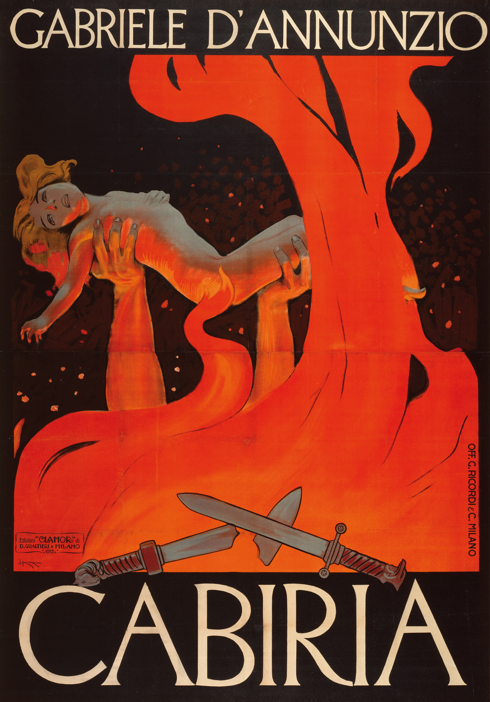

<div align="center"></div>
<div align="center"><small><sup>Film poster for <i>Cabiria (1914)</i>. Artwork by Leopoldo Metlicovitz.</sup></small></div>
<h1 align="center">
  Cabiria
</h1>

<h4 align="center">An intertitle extractor, and ASS intertitle generator, for silent films.</a></h4>
<p align="center">
  <a href="#status">Status</a> •
  <a href="#key-objectives">Key Objectives</a> •
  <a href="#install">Install</a> •
  <a href="#basic-usage">Basic Usage</a> •
  <a href="#planned-usage">Planned Usage</a> •
  <a href="#contributing">Contributing</a> •
  <a href="#license">License</a>
</p>

## Status

Cabiria is currently in pre-alpha. Stay tuned for an upcoming release!

## Key Objectives

* Detect intertitles in silent films, perform OCR using tesseract, and extract SRT.
* Generate pretty ASS intertitles, in a style that is not jarring.

## Install

As Cabiria is currently in heavy development, no installation candidate is available at this time. If you're *really* eager, you will need to set up a development environment as per the Wiki to use the application.

## Basic Usage

To extract English subtitles from English intertitles (good when you don't have access to subtitles for a film):

```bash
    cabiria extract LesVampires1915.mkv LesVampires1915.srt
```

To generate appropriate styled intertitles for existing subtitles (good when you have access to subtitles for a film, but the appearance doesn't fit well):

```bash
    cabiria generate LesVampires1915.mkv LesVampires1915.srt -o LesVampires1915.ass
```

To do both:

```bash
    cabiria retitle LesVampires1915.mkv LesVampires1915.ass
```

## Planned Usage

* `cabiria resync`: Sync external subtitles to intertitles
* `cabiria translate`: Plug into an existing subtitle translating API to translate subtitles.

## Contributing

If you wish to help out on this project: head on over to the Wiki to set up your development environment!

## License

See [LICENSE](LICENSE)