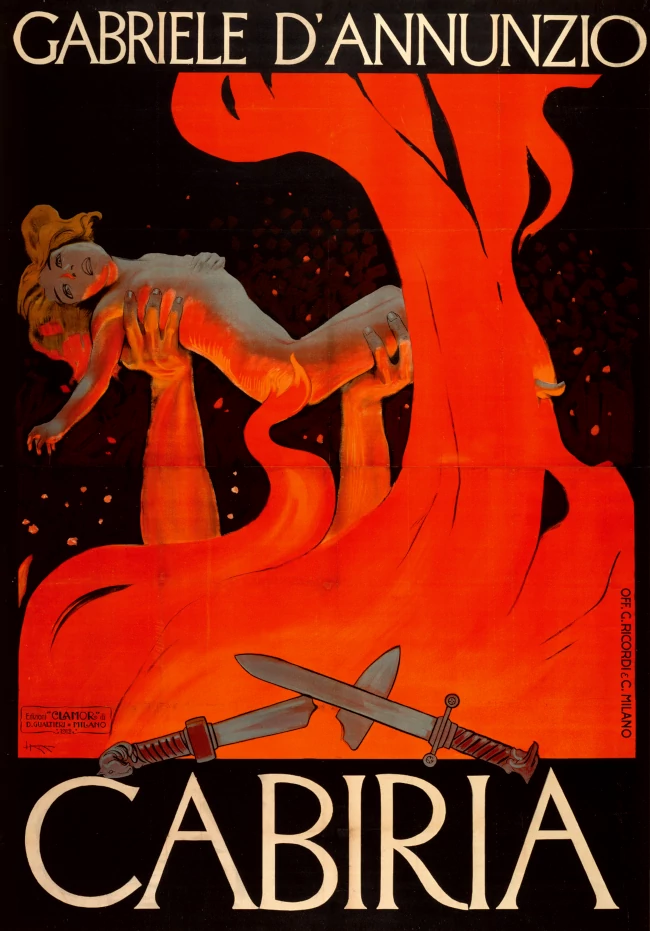

<div align="center"></div>
<div align="center"><small><sup>Film poster for <i>Cabiria (1914)</i>. Original artwork by Leopoldo Metlicovitz.</sup></small></div>
<h1 align="center">
  Cabiria
</h1>

<h4 align="center"> An ASS intertitle generator, for silent films.</a></h4>

<p align="center">
  <a href="#-status">Status</a> •
  <a href="#-key-objectives">Key Objectives</a> •
  <a href="#-system-requirements">System Requirements</a> •
  <a href="#-install">Install</a> •
  <a href="#-basic-usage">Basic Usage</a> •
  <a href="#-planned-usage">Planned Usage</a> •
  <a href="#-contributing">Contributing</a> •
  <a href="#-license">License</a>
</p>

<p align="center">
  <a href="https://travis-ci.com/liampulles/cabiria">
    
  </a>
    
  <a href="https://goreportcard.com/report/github.com/liampulles/cabiria">
    
  </a>
  <a href="https://codecov.io/gh/liampulles/cabiria">
    
  </a>
</p>

## ⚔️ Status

Cabiria is available for general usage!

## 🛡️ Key Objectives

* Generate pretty ASS intertitles, in a style that is not jarring.
* Provide a method for users to improve the generation accuracy (see [Contributing](#-contributing))

## 👺 System Requirements

* Linux
* Golang
* ffmpeg
* mediainfo

## 🗡️ Install

  1. Clone this repository for the bleeding edge version, or download from the [Releases](https://github.com/liampulles/cabiria/releases) page for a stable version.
  2. Run:

  ```bash
  make install
  ```

  3. Start generating!

## 🤺 Basic Usage

### • Generate intertitles

To generate appropriate styled intertitles for existing (e.g. `LesVampires1915.srt`) subtitles:

```bash
    cabiria-generate -video LesVampires1915.mkv -srt LesVampires1915.srt -ass LesVampires1915.ass
```

## 🎭 Planned Usage

* `cabiria-resync`: Sync external subtitles to detected intertitles in a video.

## 🐉 Contributing

### • Submit training data

If you find that the application isn't generating accurate intertitles, then consider submitting some training data for the predictor model. To do so:

  1. Fork the master branch of this repository.
  1. Run `make install`
  1. Add some training frames to `data/intertitle/frames`... importantly, if it is an intertitle frame, make sure that the name ends with `intertitle.png` (and not if not). Some suggestions / requirements:
     * The images should be in PNG format.
     * Try to select a variety of images, and balance the number evenly between intertitle images and non-intertitle images.
     * Use `ffmpeg -i <videoPath> -r 1 -vf scale=64:48 <outputPath>/<filmName>%06d.png` to extract frames from a video for inclusion, as this is (roughly) what cabiria will use when running the generation process.
     * This will bulk rename all files in the current directory to have suffix intertitle.png: `ls | xargs -I fileName mv fileName fileName.intertitle.png`.
     * Please try not to submit more than ~60 images for a given film.
  1. Run `cabiria-processdata`. This will generate `data/intertitle/data.csv`, which holds the training data.
  1. Run `cabiria-trainer`. This will generate `data/intertitle/intertitlePredictor.model`, which is the saved predictor.
  1. Run `make install`, which will install the new predictor on your machine.
  1. Try and generate intertitles for your film again, and see if there is an improvement.
  1. Make a Pull Request into master, so that we may all benefit from your addition. :)

### • Code changes

If you wish to make a code change, then I suggest making an issue for your proposal.

## 🦄 License

See [LICENSE](LICENSE)